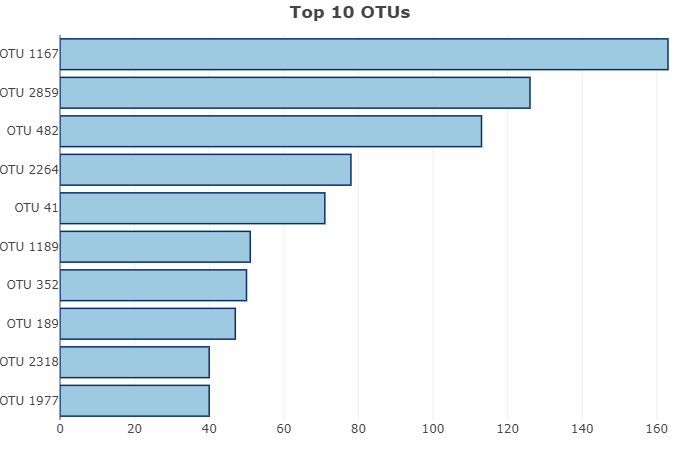
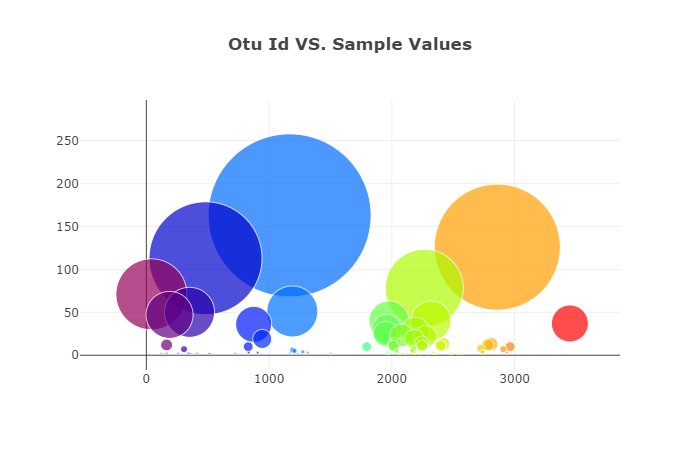
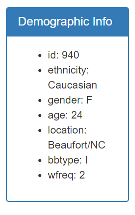
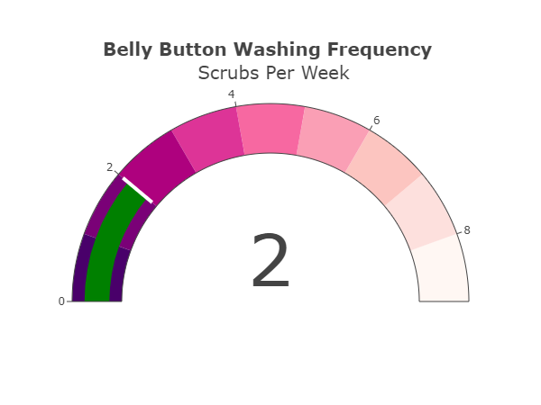
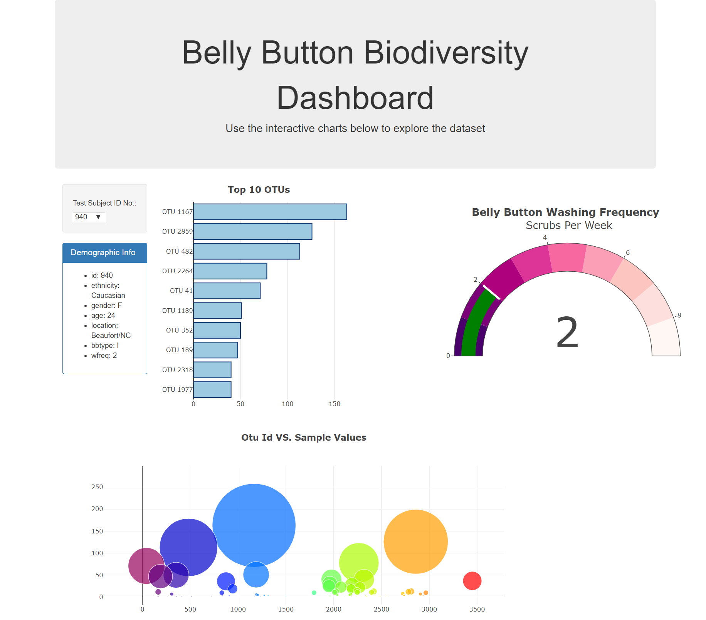

## Deployment: 
GitHub Pages: https://mariavpatino.github.io/PLOTLY_Dashboard/

# Dashboard: Belly Button Biodiversity

Interactive dashboard to explore the [Belly Button Biodiversity dataset](http://robdunnlab.com/projects/belly-button-biodiversity/), which catalogs the microbes that colonize human navels.

The dataset reveals that a small handful of microbial species (also called operational taxonomic units, or OTUs, in the study) were present in more than 70% of people, while the rest were relatively rare.
 
 

## Bar Chart

Horizontal bar chart with a dropdown menu to display the top 10 OTUs found in an individual.

 
 

## Bubble Chart

Shows the relationships between Otu Ids and Sample Values.

 
 

## Individual's demographic information

It Displays each key-value pair from the JSON data.

 
 

## Gauge Chart

Gauge charts, also known as dial charts or speedometer charts, show information as a reading on a dial. In this case, it shows the "belly button washing frequency" in each test subject.

 
 

# Final Dashboard

